# Assignment 3 — Production Maintenance Drill (OPS Checklist)

Part of the DevOps Micro Internship (DMI) Cohort 3 with Agentic AI

---

## Purpose

In this assignment, you will treat your already deployed React application (on Ubuntu VM with Nginx) as a live production system. You will perform structured operational checks covering network validation, service health, log analysis, resource monitoring, configuration verification, and incident simulation with recovery — mirroring real on-call DevOps responsibilities.

---

# Task 1 — Server Access & Networking Validation

## Goal

Verify that the deployed React application is reachable from the browser and confirm basic network connectivity of the Ubuntu VM.

### Evidence

#### Screenshot 1 — Browser showing the React app with your Full Name visible on the UI

Add your screenshot here.

---

#### Screenshot 2 — Output of `ip a`

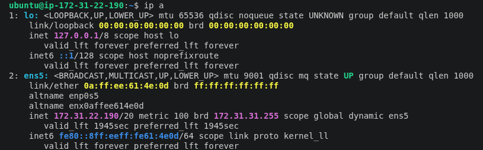

#### Screenshot 3 — Output of `sudo ss -tulpen`

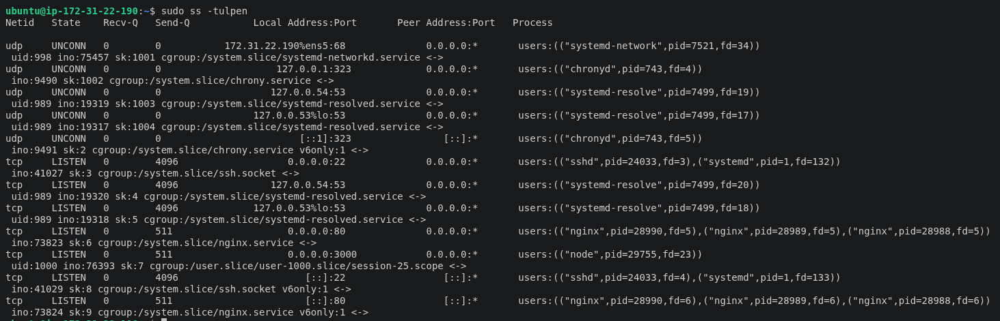

#### Screenshot 4 — Output of `sudo ufw status`

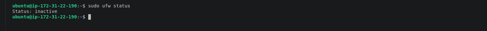

### Notes

Answer the following in your own words:

**1. What proves Nginx is listening on 0.0.0.0:80?**

When we say Nginx is listening on 0.0.0.0:80, it means:

 0.0.0.0 is a shorthand way of saying “all network interfaces on this machine.” In plain words, Nginx is ready to accept connections from any IP address that points to your server.

 :80 means it’s listening on port 80, which is the default port for websites using plain HTTP.

**2. What proves SSH is active on port 22?**

 When we say SSH is active on port 22, it means your server has its “secure door” open at address number 22, waiting for you (or anyone with the right key) to connect safely. Port 22 is the default “door” for SSH connections.

**3. Did you find any unexpected open ports? Explain briefly.**

Port 443

proves your server is ready to serve secure websites (HTTPS), with encryption protecting visitors’ data.

# Task 2 — Service Health & Systemd Validation (Nginx)

## Goal

Verify that Nginx is properly installed, running, enabled at boot, and safely configured.

### Evidence

#### Screenshot 1 — Output of `systemctl status nginx --no-pager`

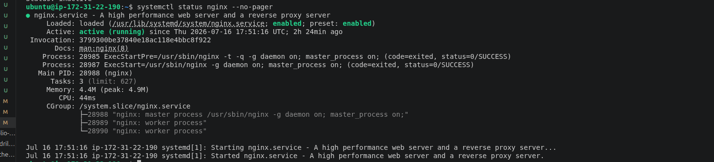

#### Screenshot 2 — Output of `sudo nginx -t`

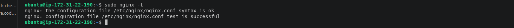

#### Screenshot 3 — Output of `sudo ss -lptn '( sport = :80 )'`

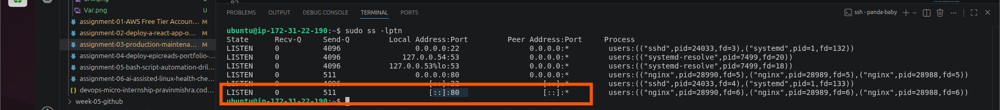

### Notes

Answer the following in your own words:

**1. What happens if Nginx fails to restart in production?**

If Nginx fails to restart in production, your website or application will immediately stop serving traffic — users will see errors or timeouts until the service is fixed. This can mean lost sales, broken APIs, or downtime for anyone relying on your server.

**2. What's your basic rollback plan?**

Necessary to have a backup that can be pulled from the nginx config incase of downtime. so having an Nginx config backup is utmost.

# Task 3 — Logs & Request Trace

## Goal

Verify real traffic flow and analyze logs to understand system behavior and errors.

### Evidence

#### Screenshot 1 — Output of `sudo tail -n 30 /var/log/nginx/access.log`

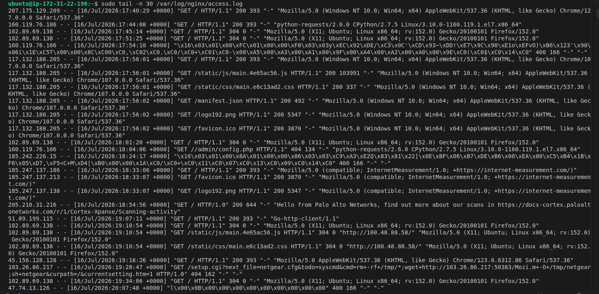

#### Screenshot 2 — Output of `sudo tail -n 30 /var/log/nginx/error.log`

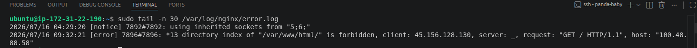

#### Screenshot 3 — Output of `sudo journalctl -u nginx --no-pager -n 50`

Add your screenshot here.

---

### Notes

Answer the following in your own words:

**1. Were there any errors in the logs?**

- If yes, mention 1–2 example error lines from the logs and explain what each one means in simple terms.
- If no, explain what it means if the error log is empty or shows no recent errors during your check.

  it means Nginx tried to show the contents of the folder /var/www/html/, but it wasn’t allowed to. Usually, this happens because:

    There’s no index file (like index.html) inside that folder, and

    Directory listing is turned off in Nginx’s configuration.

In plain words: Nginx found the folder but didn’t know what to show, so it blocked access.

---

**2. If there were no errors, what does that indicate about the system?**

Write your answer here.

---

**3. Based on the access logs, were your curl requests visible in the log entries? What does that prove about traffic flow?**

yes they were visible
It shows there is flow & communication of data from each endpoints

# Task 4 — System Resource Health Check (Capacity Red Flags)

## Goal

Assess server capacity and detect potential performance or failure risks.

### Evidence

#### Screenshot 1 — Output of `uptime`
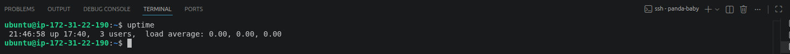

#### Screenshot 2 — Output of `free -h`

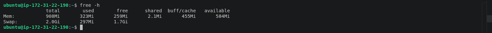

#### Screenshot 3 — Output of `df -h`
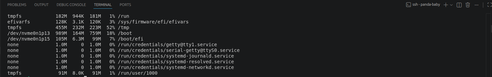

#### Screenshot 4 — Output of `sudo du -sh /var/* | sort -h`

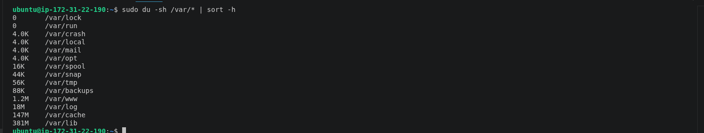

### Notes

Answer the following in your own words:

**1. Which resource looks most critical right now? (CPU/load, memory, or disk) Explain why.**

all three are critical, but memory and disk tend to cause the most immediate outages.

**2. What happens if disk becomes 100% full in a production server?**

It crashes and becomes unavailable for access/usage

# Task 5 — Configuration & Deployment Verification

## Goal

Ensure the correct React build is deployed and Nginx is serving it properly.

### Evidence

#### Screenshot 1 — Output of `ls -lah /var/www/html | head -n 20`

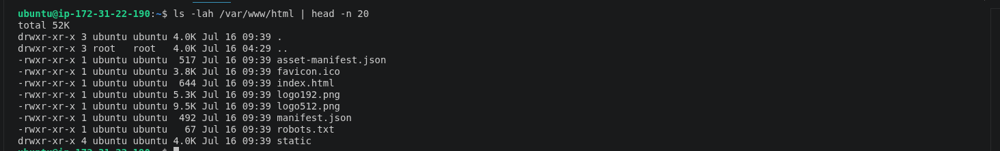

#### Screenshot 2 — Output of `grep -R "Deployed by" -n /var/www/html 2>/dev/null | head`

screenshot here

#### Screenshot 3 — Output of `grep -n "try_files" /etc/nginx/sites-available/default`

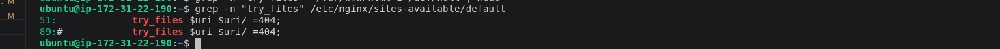

---

### Notes

Answer the following in your own words:

**1. How do you confirm that the correct version of the application is deployed?**

WAn application is considered deployed when it’s not only installed but actively running, listening on the right port, and responding to requests. We prove this by checking processes, ports, logs, and health endpoints. In simple terms, it’s like confirming the shop is open, the door is unlocked, and customers are being served.”

# Task 6 — Nginx Configuration Failure Simulation

## Goal

Simulate a real-world Nginx misconfiguration and recover the service safely.

### Evidence

#### Screenshot 1 — Output of `sudo nginx -t` showing the syntax error (broken config)

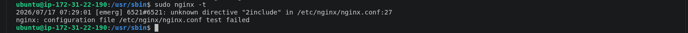

#### Screenshot 2 — Output of `sudo nginx -t` showing syntax ok (fixed config)

#### Screenshot 3 — Output of `curl -I http://<public-ip>` confirming recovery (200 OK)

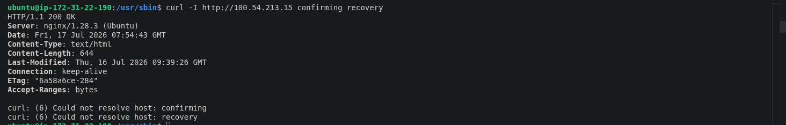

### Notes

Answer the following in your own words:

**1. What caused the configuration failure?**

Adjusted the nginx.config data

**2. How did you fix the issue?**

The error pointed out where the issue was coming from, logged in to the nignx.config using vi and removed the error.Save

#3. How can you avoid this kind of issue in real production systems?**

By paying extra careful when going through saved data and also have a backup

# Task 7 — Web Application Failure Simulation

## Goal

Simulate missing deployment content and recover the application safely.

### Evidence

#### Screenshot 1 — Output of `curl -I http://<public-ip>` showing failure (non-200 response)

Add your screenshot here.

---

#### Screenshot 2 — Output of `curl -I http://<public-ip>` confirming recovery (200 OK)

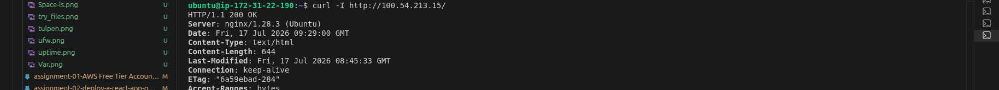

### Notes

Answer the following in your own words:

**1. What caused the application to break in this scenario?**

The application broke because the files Nginx is serving don’t match the updated React code. Either the build wasn’t refreshed, the files weren’t copied, or the server wasn’t configured correctly. 

**2. How did you fix the issue and restore the application?**

To fix the issue and restore your React application after deployment with Nginx, the solution was to go back through the DevOps pipeline and correct the missing steps.

**3. What steps would you take to prevent this kind of issue in real production systems?**
Use Version Control

Ensure all code changes are tracked and reviewed before deployment.

    Commit every change to Git

    Use pull requests for peer review

    Tag releases for clarity

# Task 8 — Security & Reliability Review

## Goal

Review and reflect on the security and reliability practices applied during this assignment.

### Security & Reliability Notes

Answer the following in your own words:

**1. Why is SSH key-based authentication more secure than sharing passwords?**

SSH key-based authentication is more secure than passwords because the private key never leaves your device, cannot be guessed or brute-forced like a password, and eliminates the risk of interception or reuse. In production, disabling password login after deploying keys reduces the attack surface dramatically. 

**2. Why should only required ports be open on a production server?**

On a production server, only the required ports should be open because every open port is like a door into your system. The more doors you leave unlocked, the more opportunities attackers have to break in. 

**3. Why is it important for Nginx to be enabled on boot?**

It’s important for Nginx to be enabled on boot because you want your web server to start automatically whenever the machine restarts — whether due to maintenance, crashes, or power outages. In production, this ensures your website or application is always available without manual intervention.

**4. What are the risks of sharing secrets, keys, or credentials publicly?**

## Unauthorized access  
Anyone who gets the secret can log in as you or your service.
Layman’s view: It’s like leaving your house key on the street — anyone can walk in.

## Data breaches  
Attackers can steal sensitive information, customer data, or financial records.
Layman’s view: Once inside, they can open all the drawers and take whatever they want.

**5. Why should cloud resources be stopped or terminated when they are no longer needed?**

Cloud resources should be stopped or terminated when they’re no longer needed because leaving them running wastes money, creates security risks, and clutters your environment. 

# LinkedIn Post (Required)

## Evidence

#### LinkedIn Post URL

Paste your LinkedIn post URL here:

`Add your URL here`

---

#### Screenshot — Published LinkedIn post

Add your screenshot here.

---

# Submission Instructions

- Add all required screenshots in your submission
- Full name must be visible in required screenshots
- Do not expose sensitive information (keys, passwords, account IDs)

---

# Completion Checklist

- [ ] Task 1: Screenshots (browser, ip a, ss -tulpen, ufw status) + Notes answered
- [ ] Task 2: Screenshots (nginx status, nginx -t, ss port 80) + Notes answered
- [ ] Task 3: Screenshots (access log, error log, journalctl) + Notes answered
- [ ] Task 4: Screenshots (uptime, free -h, df -h, du -sh) + Notes answered
- [ ] Task 5: Screenshots (ls html, grep deployed by, grep try_files) + Notes answered
- [ ] Task 6: Screenshots (nginx -t fail, nginx -t pass, curl recovery) + Notes answered
- [ ] Task 7: Screenshots (curl failure, curl recovery) + Notes answered
- [ ] Task 8: Security & Reliability Notes answered
- [ ] LinkedIn post published and URL submitted
- [ ] Full Name visible in all required screenshots
- [ ] No sensitive data exposed

---

## 📌 About DMI & CloudAdvisory

DevOps Micro Internship (DMI) is a project-based DevOps program run by Pravin Mishra (The CloudAdvisory) focused on real-world execution, systems thinking, and career readiness.

It helps learners build strong DevOps foundations with hands-on experience.

---

## 📌 Resources

- 🌐 DMI Official Website: https://pravinmishra.com/dmi  
- 🎓 DevOps for Beginners (Udemy): https://www.udemy.com/course/devops-for-beginners-docker-k8s-cloud-cicd-4-projects/  
- 🎓 Agentic AI DevOps with Claude Code: https://www.udemy.com/course/ultimate-agentic-ai-devops-with-claude-code/  
- 🎓 DevOps with Claude Code: Terraform, EKS, ArgoCD & Helm: https://www.udemy.com/course/devops-with-claude-code-terraform-eks-argocd-helm/  
- ▶️ YouTube Playlist: https://www.youtube.com/playlist?list=PLFeSNDtI4Cho  
- 🔗 Pravin Mishra (LinkedIn): https://www.linkedin.com/in/pravin-mishra-aws-trainer/  
- 🏢 CloudAdvisory (LinkedIn): https://www.linkedin.com/company/thecloudadvisory/

---

*This submission is part of DevOps Micro Internship (DMI) Cohort 3 — Agentic AI Track.*