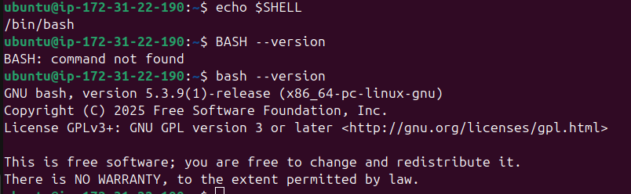
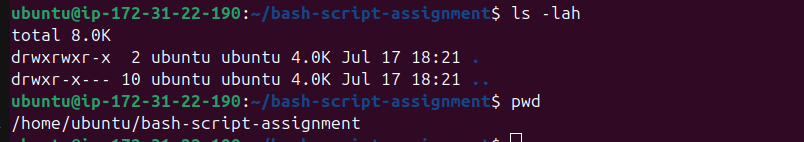
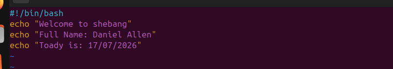
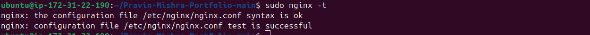
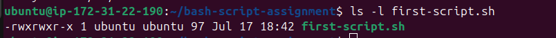
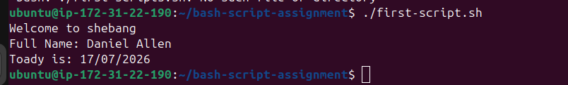
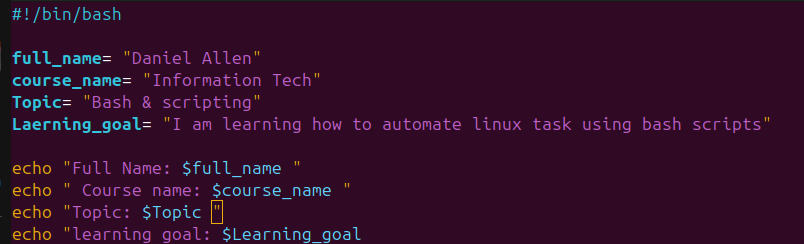

# Assignment 5 — Bash Script Automation Drill (OPS Checklist)

Part of the DevOps Micro Internship (DMI) Cohort 3 with Agentic AI

---

## Purpose

In this assignment, you will practice Bash scripting by building a series of small automation scripts covering environment setup, variables, arrays, loops, file conditionals, if-else logic, and functions. These scripts form the foundation of real-world Linux automation used in DevOps, cloud, and production support environments.

---

# Task 1 — Bash Environment & Workspace Setup

## Goal

Verify that Bash is available on your system and create a clean workspace for this assignment.

### Evidence

#### Screenshot 1 — Output of `echo $SHELL` and `bash --version`

#### Screenshot 2 — Output of `pwd` and `ls -lah` showing the scripts directory

### Notes

Answer the following in your own words:

**1. What is Bash?**

Bash is basically the “voice” you use to talk directly to your computer’s operating system — instead of clicking icons, you type commands, and the computer listens and responds. It’s both a command-line tool and a scripting language, making it powerful for everyday tasks and automation.
**2. What is the difference between shell and Bash?**

a shell is the general program that lets you talk to your operating system with commands, while Bash is one specific type of shell — the “Bourne Again Shell” — that adds more features and is the default on most Linux systems.

**3. Why is it important to confirm the Bash version before writing scripts?**

It’s important to confirm the Bash version before writing scripts because different versions support different features, and older versions may lack commands or contain security vulnerabilities. 

# Task 2 — Your First Bash Script

## Goal

Create your first Bash script, make it executable, and run it from the terminal.

### Evidence

#### Screenshot 1 — Content of `first-script.sh`

#### Screenshot 2 — Output of `./first-script.sh`

#### Screenshot 3 — Output of `ls -l first-script.sh` showing executable permission

---

### Notes

Answer the following in your own words:

**1. What is the purpose of `#!/bin/bash`?**

It tells the operating system: “Run this script using Bash.” Without it, the system might try to run the script with another shell (like sh or dash), which could cause errors if your script uses Bash-specific features.

**2. Why do we use `chmod +x` before running a script?**

chmod changes file permissions. The +x flag adds “execute” permission, meaning the file can be run like a program.

**3. What is the difference between running a script using `./script.sh` and `bash script.sh`?**

./script.sh

    Runs the script as a standalone program.

    The operating system looks at the shebang line (#!/bin/bash) at the top of the file to decide which interpreter to use.

    Requires the script to have execute permission (chmod +x script.sh).

bash script.sh

    Explicitly tells the system: “Run this file using Bash.”

    Does not require execute permission — it’s just being passed as input to the bash program.

    Ignores the shebang line, because you already specified Bash.

---

# Task 3 — Variables: User Information Script

## Goal

Use variables to store and display user-related information.

### Evidence

#### Screenshot 1 — Content of `user-info.sh`

A
#### Screenshot 2 — Output of `./user-info.sh`

### Notes

Answer the following in your own words:

**1. What is a variable in Bash?**

A variable in Bash is simply a named container that stores a value (like text, numbers, or even the result of a command) so you can reuse it later in your script.

---

**2. Why should we avoid spaces around the `=` sign when creating variables?**

In Bash, spaces around the = sign break variable assignment because Bash interprets them differently than you might expect.
---

**3. How do you access the value stored inside a Bash variable?**

In Bash, you access the value stored inside a variable by prefixing the variable name with a $ symbol.
---

# Task 4 — Arrays & Loops: Tools Checklist Script

## Goal

Use arrays and loops to print a checklist of tools used in Bash scripting.

### Evidence

#### Screenshot 1 — Content of `tools-checklist.sh`

Add your screenshot here.

---

#### Screenshot 2 — Output of `./tools-checklist.sh`

Add your screenshot here.

---

### Notes

Answer the following in your own words:

**1. What is an array in Bash?**

Add your answer here.

---

**2. Why are arrays useful in scripts?**
Arrays in Bash are useful because they let you store and manage multiple values under a single variable name, instead of creating dozens of separate variables. This makes scripts cleaner, more powerful, and easier to maintain.

**3. What does `"${tools[@]}"` mean?**

In Bash, "${tools[@]}" is a way to expand all the elements of an array called tools. It’s one of the most common patterns you’ll see when working with arrays in scripts.

---

**4. What is the purpose of the `for` loop in this script?**

The purpose of the for loop in your script is to repeat a set of commands for each item in a list or array.

---

# Task 5 — Loops: Number Counter Script

## Goal

Use loops to repeat a task multiple times.

### Evidence

#### Screenshot 1 — Content of `counter.sh`

Add your screenshot here.

---

#### Screenshot 2 — Output of `./counter.sh`

Add your screenshot here.

---

### Notes

Answer the following in your own words:

**1. What is a loop?**

Add your answer here.

---

**2. Why do we use loops in Bash scripting?**

Add your answer here.

---

**3. How many times did the loop run in your script?**

Add your answer here.

---

**4. What would you change if you wanted the loop to run 10 times?**

Add your answer here.

---

# Task 6 — Files & Conditionals: File Validation Script

## Goal

Use file checks and conditionals to verify whether files and directories exist.

### Evidence

#### Screenshot 1 — Output of `ls -lah ../test-folder`

Add your screenshot here.

---

#### Screenshot 2 — Content of `file-check.sh`

Add your screenshot here.

---

#### Screenshot 3 — Output of `./file-check.sh`

Add your screenshot here.

---

### Notes

Answer the following in your own words:

**1. What does `-d` check in Bash?**

Add your answer here.

---

**2. What does `-f` check in Bash?**

Add your answer here.

---

**3. Why should file and directory paths be stored in variables?**

Add your answer here.

---

**4. What happens if the file does not exist?**

Add your answer here.

---

# Task 7 — Conditionals: Pass or Retry Script

## Goal

Use if-else conditionals to make decisions based on a variable value.

### Evidence

#### Screenshot 1 — Content of `score-check.sh` with `score=85`

Add your screenshot here.

---

#### Screenshot 2 — Output showing `Result: Pass`

Add your screenshot here.

---

#### Screenshot 3 — Content of `score-check.sh` with `score=55`

Add your screenshot here.

---

#### Screenshot 4 — Output showing `Result: Retry`

Add your screenshot here.

---

### Notes

Answer the following in your own words:

**1. What is the purpose of if-else in Bash?**

Add your answer here.

---

**2. What does `-ge` mean?**

Add your answer here.

---

**3. Why should conditions be tested with different values?**

Add your answer here.

---

**4. How can conditionals help in automation scripts?**

Add your answer here.

---

# Task 8 — Functions: Final Bash Automation Script

## Goal

Create a final Bash script using functions to organize reusable code.

### Evidence

#### Screenshot 1 — Content of `final-automation.sh`

Add your screenshot here.

---

#### Screenshot 2 — Output of `./final-automation.sh`

Add your screenshot here.

---

#### Screenshot 3 — Output of `ls -lah` showing all created scripts

Add your screenshot here.

---

### Notes

Answer the following in your own words:

**1. What is a function in Bash?**

Add your answer here.

---

**2. Why are functions useful in scripts?**

Add your answer here.

---

**3. Which functions did you create in this script?**

Add your answer here.

---

**4. How does this final script combine variables, arrays, loops, conditionals, files, and functions?**

Add your answer here.

---

# LinkedIn Post (Required)

## Evidence

#### LinkedIn Post URL

Paste your LinkedIn post URL here:

`__________________________`

---

#### Screenshot — Published LinkedIn post

Add your screenshot here.

---

# Submission Instructions

- Add all required screenshots in your submission
- Full name must be visible in required screenshots
- All script files must be created and run successfully
- Required notes must be answered clearly for every task
- Do not expose sensitive information (keys, passwords, credentials)

---

# Completion Checklist

- [ ] Task 1: Environment setup verified, workspace created (Screenshots 1–2, Notes answered)
- [ ] Task 2: First script created, executed, permissions verified (Screenshots 1–3, Notes answered)
- [ ] Task 3: Variables script created and run (Screenshots 1–2, Notes answered)
- [ ] Task 4: Arrays and loops script created and run (Screenshots 1–2, Notes answered)
- [ ] Task 5: Counter loop script created and run (Screenshots 1–2, Notes answered)
- [ ] Task 6: File validation script created and run (Screenshots 1–3, Notes answered)
- [ ] Task 7: Pass/Retry conditional script tested with both values (Screenshots 1–4, Notes answered)
- [ ] Task 8: Final automation script created and run (Screenshots 1–3, Notes answered)
- [ ] All scripts run without errors
- [ ] Full Name visible in all required screenshots
- [ ] LinkedIn post published and URL submitted
- [ ] No sensitive data exposed

---

## 📌 About DMI & CloudAdvisory

DevOps Micro Internship (DMI) is a project-based DevOps program run by Pravin Mishra (The CloudAdvisory) focused on real-world execution, systems thinking, and career readiness.

It helps learners build strong DevOps foundations with hands-on experience.

---

## 📌 Resources

- 🌐 DMI Official Website: https://pravinmishra.com/dmi  
- 🎓 DevOps for Beginners (Udemy): https://www.udemy.com/course/devops-for-beginners-docker-k8s-cloud-cicd-4-projects/  
- 🎓 Agentic AI DevOps with Claude Code: https://www.udemy.com/course/ultimate-agentic-ai-devops-with-claude-code/  
- 🎓 DevOps with Claude Code: Terraform, EKS, ArgoCD & Helm: https://www.udemy.com/course/devops-with-claude-code-terraform-eks-argocd-helm/  
- ▶️ YouTube Playlist: https://www.youtube.com/playlist?list=PLFeSNDtI4Cho  
- 🔗 Pravin Mishra (LinkedIn): https://www.linkedin.com/in/pravin-mishra-aws-trainer/  
- 🏢 CloudAdvisory (LinkedIn): https://www.linkedin.com/company/thecloudadvisory/

---

*This submission is part of DevOps Micro Internship (DMI) Cohort 3 — Agentic AI Track.*